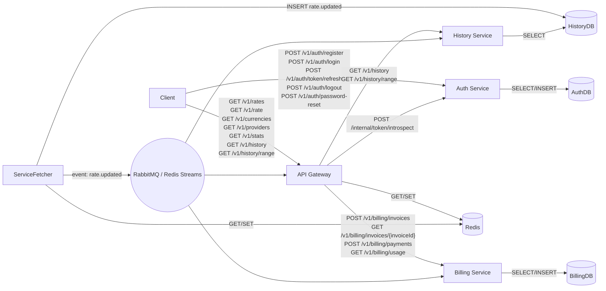

## 1. Введение

**1.1. Цели проекта**

* Предоставить REST-API для получения курсов фиатных и криптовалют с упором на СНГ-рынок.
* Обеспечить доступ к актуальным курсам «на сейчас» и к историческим данным за произвольные даты.

**1.2. Описание организации**
ExRateHub — инновационная компания, специализирующаяся на агрегации и распространении данных по курсам валют и криптовалют. Наша миссия — предоставить разработчикам и бизнесам простые интеграции для мгновенного доступа к точным и актуализированным финансовым данным. Мы ориентированы на рынок СНГ, но поддерживаем мировые фиатные и цифровые активы.
Ключевые ценности:

* **Надёжность**: гарантируем доступность и точность данных.
* **Гибкость**: широкие возможности кастомизации и масштабирования.
* **Прозрачность**: чёткая документация и открытые SLA.
* **Инновации**: постоянное расширение источников и сервисов для пользователей.

**1.3. Целевая аудитория и сценарии использования**

* Финтех-компании и банки СНГ, нуждающиеся в упрощённом доступе к курсам ЦБ и крупнейших банков.
* Разработчики сервисов и мобильных приложений, где требуется быстрый обмен фиат/крипто.
* BI-аналитики и отчётность на основе исторических трендов.

---

## 2. Общие требования

**2.1. Объём и границы системы**

* Сервис выдаёт только данные (курсы), без операций обмена или хранения средств.
* Поддержка фиатных валют (CBR, Сбербанк, ВТБ, MOEX) и криптовалют (Binance и др.).

**2.2. Основные термины и сокращения**

* **API-ключ** — токен для аутентификации.
* **Redis-кеш** — слой быстрого чтения актуальных курсов с TTL.
* **Provider** — код источника данных (CBR, MOEX, BINANCE и т. д.).
* **RateType** — тип курса (MID, BUY, SELL).
* **SLA** — целевой уровень доступности.

**2.3. Технологический стек и порядок разработки**

* **Язык и фреймворки**: Python 3.11+, Litestar для HTTP-сервисов, SQLAlchemy + Alembic для работы с PostgreSQL, Redis-Py для кеша.

* **Фоновые задачи**: Celery + Redis/RabbitMQ для периодического fetcher-а.

* **Контейнеризация**: Docker, Docker Compose для локальной среды, Helm-чарты для Kubernetes (дальнейший этап).

* **CI/CD (Continuous Integration / Continuous Deployment)**: практика автоматизации сборки, тестирования и доставки кода. С помощью CI системы (например, GitHub Actions) при каждом изменении в репозитории автоматически:

  * **CI (Continuous Integration)**: выполняют сборку, линтинг (Black, Flake8) и прогон тестов (pytest), чтобы гарантировать, что новые изменения не «ломают» существующий код.
  * **CD (Continuous Deployment)**: собирают Docker-образы и автоматически деплоят обновлённые сервисы на стадии staging или production (через Ansible/SSH), обеспечивая быструю и надёжную доставку.

* **Мониторинг и логирование**: Prometheus + Grafana, Loki, Sentry.

* **Биллинг и платежи**: Stripe API интеграция в Billing Service.

**Порядок разработки**:

1. **Настройка инфраструктуры**: репозиторий, CI/CD, Docker Compose (PostgreSQL, Redis, сервисы skeleton).
2. **Service-Fetcher**: реализация fetcher-а, интеграция с внешними API, запись в Redis/SQL.
3. **Auth Service**: CRUD для API-ключей, валидация, интеграция с Billing Service.
4. **History Service**: эндпоинты `/v1/history` и `/v1/history/range`, доступ к БД.
5. **API Gateway**: маршрутизация запросов, проверка ключей, rate-limit, проксирование к микросервисам.
6. **Billing Service**: выставление счетов, приём вебхуков оплаты, отчёты по использованию.
7. **Интеграция и тесты**: end-to-end тесты, нагрузочное тестирование.
8. **Документация**: генерация OpenAPI, написание примеров и гида.

### 2.4. Архитектура микросервисов

Для обеспечения модульности и лёгкого масштабирования система разбивается на следующие сервисы: и лёгкого масштабирования система разбивается на следующие сервисы:

1. **Service-Fetcher**

   * Обращается к внешним провайдерам (CBR, MOEX, Binance и др.) по расписанию.
   * Записывает актуальные курсы в Redis и историю в PostgreSQL.
2. **API Gateway**

* `GET /v1/rates` — список текущих курсов (параметры: `base`, `currencies[]`, `provider?`, `rateType?`).
* `GET /v1/rate` — курс одной валюты к другой (`from`, `to`, `provider?`, `rateType?`).
* `GET /v1/currencies` — список поддерживаемых валют и криптопар (без параметров).
* `GET /v1/providers` — список доступных провайдеров (фильтр по `currency`).
* `GET /v1/stats` — статистика использования (заголовки rate-limit).
* Проксирование запросов к History Service и Auth Service.

**Auth Service**\*\*\*\*

* Управление жизненным циклом API-ключей: создание, отзыв и валидация ключей.
* Делегирует хранение и проверку информации о платежах и квотах Billing Service.

4. **History Service**

   * Отвечает за запросы к истории курсов.
   * Читает данные из PostgreSQL и форматирует ответ.
5. **Billing Service**

   * Управление платёжными операциями (Stripe и др.).
   * Генерация счетов и отчётов по оплате.
6. **Monitoring & Metrics**

   * Сбор метрик (Prometheus) и логов (Loki/Sentry).
   * Дашборды и алерты в Grafana.

### 2.4. Детальное описание микросервисов и их эндпоинтов

#### 2.4.1. Service-Fetcher

**Назначение:**

* Периодически опрашивает внешние источники курсов (CBR, MOEX, Binance и др.) по расписанию.
* Обрабатывает ответы провайдеров, нормализует данные и сохраняет:

  * **Redis**: актуальные курсы (TTL для фиата и крипто).
  * **PostgreSQL**: исторические записи курсов.

**Публичные эндпоинты:** нет (работает в фоне).

**Внутренние API:**

* **POST /fetch/provider/{providerCode}** — инициировать ручной fetch для указанного провайдера.
* **GET /fetch/status** — статус последнего выполнения по всем провайдерам.

---

#### 2.4.2. Auth Service

**Назначение:**

* Управление API-ключами и квотами.
* Валидация запросов клиентов (проверка ключа, тарифного плана и лимитов).
* Делегирование биллинг-логики в Billing Service.
* **Регистрация и управление пользователями:**

  * Регистрация по email и паролю с подтверждением email.
  * Вход (login) с выдачей токенов.
  * Сброс пароля через email-ссылку.
  * Смена пароля для авторизованных пользователей.

**Токены и сессии:**

* Все токены (Access и Refresh) выдаются и хранятся Auth Service.
* **Access Token**: JWT, самостоятельно валидируется другими сервисами по публичному ключу, не хранится в БД.
* **Refresh Token**: UUID-строка, хранится в БД (или Redis) Auth Service для поддержки механизма отзыва и отслеживания срока жизни.
* Access Token передаётся в заголовке `Authorization: Bearer <token>` для защищённых операций в API Gateway и микросервисах.
* Refresh Token передаётся в теле запроса для обновления Access Token.

**Механизм отзыва токенов:**

* При logout или смене пароля Refresh Token помечается как отозванный в хранилище.
* API Gateway и другие сервисы при валидации могут обращаться к Auth Service (через внутренний endpoint `POST /internal/token/introspect`) для проверки статуса Refresh Token.

---

#### 2.4.3. History Service

**Назначение:**

* Обслуживание запросов к историческим данным курсов.
* Читает из PostgreSQL и преобразует в формат API.

**Эндпоинты:**

* **GET /v1/history** — история на конкретную дату (параметры: base, currencies\[], date, provider?).
* **GET /v1/history/range** — данные за диапазон дат (параметры: base, currencies\[], startDate, endDate, provider?).

---

#### 2.4.4. API Gateway

**Назначение:**

* Основная точка входа для клиентов.
* Агрегирует запросы к микросервисам (Auth, Fetcher, History и Billing).
* Валидация параметров запросов и ответов.
* Применяет кеширование (Redis) и rate-limit (Auth Service + Redis).

**Эндпоинты:**

* **GET /v1/rates** — актуальные курсы (параметры: base, currencies\[], provider?, rateType?).
* **GET /v1/rate** — курс "from" к "to" (параметры: from, to, provider?, rateType?).
* **GET /v1/currencies** — список поддерживаемых валют и криптопар.
* **GET /v1/providers** — список доступных провайдеров (фильтр по currency).
* **GET /v1/stats** — статистика собственных вызовов и остаток квот.

---

#### 2.4.5. Billing Service

**Назначение:**

* Обработка платежей и управление тарифами.
* Интеграция со Stripe или другими платёжными шлюзами.
* Формирование счетов и отчётов по оплате и использованию.

**Эндпоинты:**

* **POST /v1/billing/invoices** — создание и отправка счёта клиенту (параметры: keyId, period, amount).
* **GET /v1/billing/invoices/{invoiceId}** — получение статуса счета.
* **POST /v1/billing/payments** — регистрация совершённого платежа (webhook).
* **GET /v1/billing/usage** — отчёт по потреблению API за период (keyId, startDate, endDate).

---

#### 2.4.6. Monitoring & Metrics

**Назначение:**

* Сбор метрик работы сервисов (latency, error rate, throughput).
* Централизованное логирование ошибок и трассировка запросов.
* Настройка алертов при критических событиях.

**Эндпоинты и интеграции:**

* **GET /metrics** — Prometheus-совместимый endpoint для сбора метрик.
* **Webhook** (Slack/Email) — оповещение о падении сервисов и превышении порогов.
* **Sentry SDK** — автоматический сбор ошибок внутри сервисов.

---

#### 2.4.7. Взаимодействие микросервисов

**Синхронное взаимодействие:**

* Клиенты обращаются к **API Gateway** по HTTP(S); Gateway проксирует авторизованные запросы к **History Service**, **Auth Service** и **Billing Service** через внутренние REST API.
* Для проверки токенов и квот **API Gateway** делает внутренний запрос `POST /internal/token/introspect` к Auth Service.

**Асинхронное взаимодействие:**

* **Service-Fetcher** публикует обновлённые курсы в шину сообщений (RabbitMQ/Redis Streams). **History Service** и **API Gateway** могут подписываться на соответствующие топики для актуализации кеша и БД.
* **Billing Service** подписывается на события создания и отзыва API-ключей (через шину), чтобы обновлять квоты и выставлять счета.

**Обмен данными через базу данных:**

* **Service-Fetcher** и **History Service** работают над одной базой **HistoryDB**, где Fetcher пишет, а History Service читает данные о курсах.
* **Auth Service** и **Billing Service** используют отдельные БД (AuthDB и BillingDB), но при необходимости Billing Service может делать внутренние запросы к Auth Service для получения информации о пользователях.

**Шина сообщений:** RabbitMQ или Redis Streams используются для событий:

* `rate.updated` — новые курсы доступны.
* `apikey.created`, `apikey.revoked` — управление квотами.
* `invoice.generated`, `payment.completed` — события биллинга.

---

#### 2.4.8. Диаграмма взаимодействия (Mermaid)

* **Типовые коды ошибок**:

  * `400 Bad Request` — некорректный запрос (например, неверный формат даты).
  * `401 Unauthorized` — отсутствует или недействителен API-ключ.
  * `403 Forbidden` — превышены лимиты или нет доступа к выбранному тарифу.
  * `404 Not Found` — не найдены запрашиваемые валюты/провайдеры.
  * `429 Too Many Requests` — превысился rate-limit.
  * `500 Internal Server Error` — внутренняя ошибка сервиса.

## 4. Нефункциональные требования

* **Производительность**: P95 latency < 200 мс для `GET /rates` при среднем трафике до 100 RPS.
* **Доступность**: SLA 99.9 %; автоматическое восстановление при сбоях.
* **Масштабируемость**: стартовый стек на Docker Compose с возможностью миграции в Kubernetes.
* **Безопасность**: HTTPS на всём трафике; WAF на уровне облака; валидация запросов; хранение секретов в AWS Secrets Manager или HashiCorp Vault.
* **Логирование и мониторинг**: Sentry для ошибок; Prometheus + Grafana для метрик или облачное решение (Datadog/New Relic) по мере роста.
* **Хранение логов**: Retention 14 дней; используйте Loki + Grafana или облачный агрегатор логов.

---

## 5. Интеграция с источниками курсов

* **Основные фиатные провайдеры (СНГ и мировой охват)**:

  * Центральный банк РФ (CBR) — официальные курсы 30+ валют.
  * Московская биржа (MOEX) — рыночные курсы 50+ валютных пар.
  * Сбербанк, ВТБ — коммерческие курсы покупки/продажи по 10–20 валютам.
  * Национальные банки Украины, Казахстана, Белоруссии — по 10–15 локальным валютам.

* **Дополнительные фиатные провайдеры (глобальные)**:

  * European Central Bank (ECB) — курсы по 30 валютам.
  * Forex API (например, exchangeratesapi.io) — более 170 валют.

* **Криптовалютные провайдеры**:

  * Binance — 2000+ монет и токенов.
  * OKX, Kraken, Coinbase — дополнительные 500–1000 активов.
  * CoinGecko API — агрегирует данные по 8000+ криптоактивам.

* **Общее количество поддерживаемых инструментов**:

  * **Фиат**: базовая поддержка 50–100 популярных валют, с возможностью расширения до 170+.
  * **Крипто**: первичный набор 100–200 ключевых криптовалют, масштабируемый до 5000+ при интеграции CoinGecko.

* **Частота обновления**:

  * Фиат: 1 раз в час или по расписанию ЦБ.
  * Крипто: каждые 1–5 минут.

* **Кеширование и хранение**:

  * Redis: TTL для актуальных данных (5 мин для крипто, 1 ч для фиата).
  * PostgreSQL: хранение истории за последний год (или дольше).

---

## 6. Пользовательские роли и биллинг

| Тариф      | Цена (USD/мес) | Лимиты запросов                                             | Описание                                |
| ---------- | -------------- | ----------------------------------------------------------- | --------------------------------------- |
| **Free**   | 0              | • 30 запросов в минуту• 100 в час• 1 000 в день             | Личное и тестовое использование.        |
| **Team**   | 49             | • 200 запросов в минуту• 1 000 в час• 10 000 в день         | Малые команды (до 5 пользователей).     |
| **Custom** | по запросу     | • До 10 000+ запросов в минуту• Специальные SLA и поддержка | Enterprise-решения, большие интеграции. |

---

## 7. Требования к среде исполнения и деплою

* **Хостинг**: VPS от Beget; один или несколько VPS для сервисов.
* **Инфраструктура баз данных**: PostgreSQL и Redis развёрнуты на отдельных VPS или через managed-сервисы Beget, при необходимости масштабируются вертикально/горизонтально.
* **Контейнеризация**: Docker Compose для локальной разработки и деплоя на VPS; контейнеры запускаются под supervision (systemd/docker-compose).
* **CI/CD**: GitHub Actions для lint, тестов, сборки Docker-образов и деплоя на VPS через SSH/Ansible.
* **Окружения**: dev (локально), staging (VPS staging), prod (VPS production).
* **Управление секретами**: переменные окружения в окружении VPS или HashiCorp Vault/Beget Secrets Manager.

---

## 8. Тестирование

* **Unit-тесты**: pytest + pytest-asyncio, покрытие \~80 % критических модулей.
* **Интеграционные тесты**: HTTPX + тестовый Docker Compose (PostgreSQL + Redis).
* **Нагрузочное тестирование**: k6 или locust для ключевых эндпоинтов, минимум раз в месяц.
* **CI**: автоматический прогон всех тестов и генерация отчёта покрытия.

---

## 9. Документация и поддержка

* **API-документация**: автоматически генерируется из спецификации OpenAPI (Swagger UI/Redoc).
* **User guide**: README с примерами `curl` и Python-клиента.
* **Поддержка**: канал в Slack; email [support@example.com](mailto:support@example.com).

---

## 10. План реализации и риски

* **Этапы**:

  1. Развёртывание микросервисной платформы (2 недели): Service-Fetcher, API Gateway, Auth Service, History Service, Billing Service, базовая настройка Redis и PostgreSQL.
  2. Реализация основных эндпоинтов (`/rate`, `/rates`, `/history`) + механизмы кеширования и валидации API-ключей (4 недели).
  3. Настройка биллинга, тарифов, мониторинга и алёртов, подготовка документации и поддержки (6 недель).
* **Риски**:

  * Зависимость от внешних API (отказы CBR/MOEX). **Меры**: fallback-провайдеры, повторные попытки, alerting.
  * Ограничения rate-limit у провайдеров. **Меры**: локальный кэш, очередь запросов, резервные источники.
  * Ограниченные ресурсы команды. **Меры**: фокус на начальной платформе, автоматизация CI/CD, повторное использование готовых решений.---

## 11. Service Level Agreement (SLA)

SLA (Service Level Agreement) — это соглашение с клиентом, определяющее минимальный уровень доступности и качества сервиса. Основные понятия:

* **Uptime** (время доступности) — процент времени, когда услуга работает корректно и отвечает на запросы.
* **Downtime** (время простоя) — суммарное время, когда сервис недоступен.
* **Порог SLA** 99.9% означает, что в течение месяца сервис может быть недоступен не более 0.1% времени (примерно 43.8 минуты).
* **Компенсации** — механизм возврата или кредита клиенту за нарушение SLA.

Далее основные параметры SLA для нашего API:

* **Уровень доступности**: 99.9% uptime (не более 43.8 минут недоступности в месяц).
* **Метрики мониторинга**: availability, error rate, latency.
* **Пороговые значения**:

  * Latency P95 < 200 мс
  * Error rate < 1%
* **Компенсации**: кредит за следующий месяц при просадке SLA: 10% за каждый 0.1% ниже 99.9%, максимум 50%.
* **Процедура эскалации**:

  1. Клиент сообщает о проблеме в поддержку (Slack/email).
  2. Инженерная команда проводит triage в течение 1 часа.
  3. Эскалация к CTO при невосстановлении within 4 часов.---

## 12. Юридические и коммерческие аспекты

* **Terms of Service**: проектируется на основе стандартных соглашений. Включает положения об ответственности, ограничениях и правах сторон.
* **Privacy Policy**: соответствует GDPR и локальным законам о персональных данных. Хранение и удаление логов по запросу.
* **Политика возвратов**: кредит за неоказанную услугу при нарушении SLA.
* **Юридический адрес и контактная информация**: добавляется в финальную версию.
